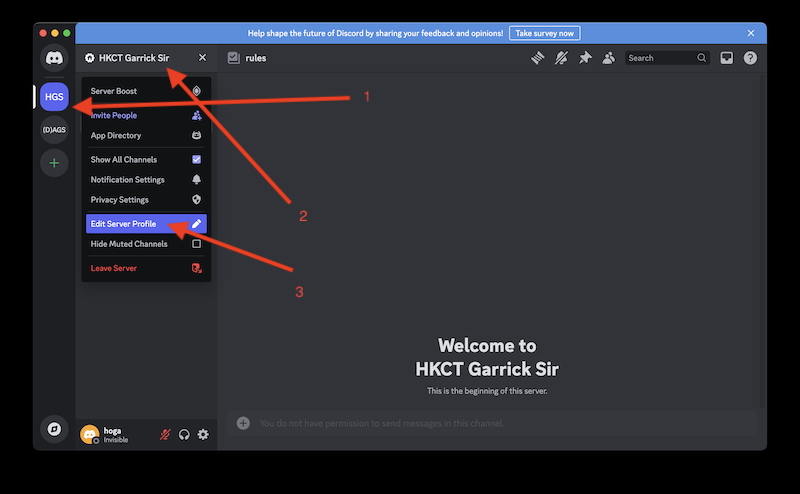
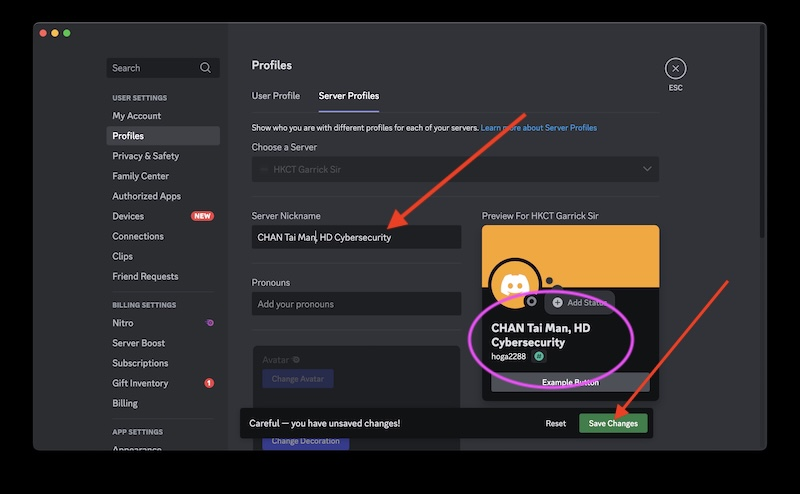

# Joining HKCT Garrick Sir Discord Server

## Steps

### Step 1: Install Discord

1. Create a Discord account in the Discord.com if you don't have any.

   https://discord.com/register

2. Download the Discord app from the Discord website.

   https://discord.com/download

3. Join "HKCT Garrick Sir" server by click the following invitation URL.

   https://discord.gg/x78JHGwp6W

   You can use Discord on PC, mac or mobile phone.
   You can even use Discord in a web browser.

### Step 2: Update Discord Server Profile

It will be great if I can know your REAL name in my Server.
Please follow the steps belows such that I can get familiar with you.

如果我知道你的真实名字，沟通会更为方便。
请按照以下步骤操作，以便我可以更熟悉您。

1. Click the locations shown in the following figure to bring up your Server Profile.

   a.  Click "HGS" Server icon.
   b.  Click "HKCT Garrick Sir" and pop up the pull down menu.
   b.  Click the "Edit Server Profile". 

   

2. Your Server Profile will be popped up.  Then

   a. Updated the "Server Nickname" with your REAL name and program shown as follows.

      For example:  
      例子:   

      CHAN Tai Man , HD Cybersecurity   
      陳大文, 網絡安全高級文憑（檢測及合規）  
      陈大文, 网络安全高级文凭（检测及合规）   

      A preview ( purple circle in the figure ) will be shown.

      
   
   b. Click "Save Changes" button.

   c. The change is effective in "HKCT Garrick Sir" Server only.  It will not change your "Server Nickname" in other Discord Servers.

